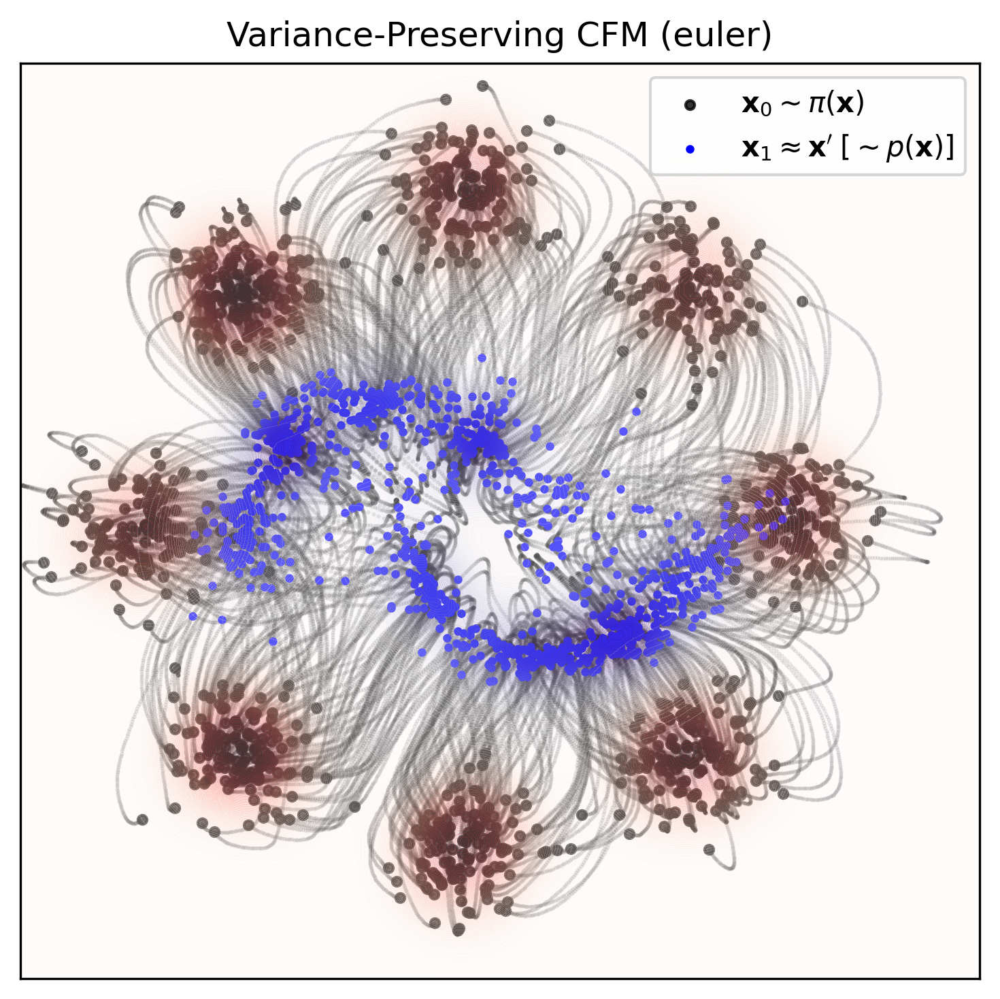

# Conditional Flow Matching (MLX)

<p align="center">
  
</p>

_Conditional Flow Matching (CFM)_: a simulation-free training objective for continuous normalizing flows.​ We explore a few different flow matching variants and ODE solvers on a simple dataset. This repo was inspired and adapted by the awesome work in [TorchCFM](https://github.com/atong01/conditional-flow-matching) and [Torchdyn](https://github.com/DiffEqML/torchdyn). 

## Background

**Training**: consider a smooth time-varying vector field $u\\,:\\,[0, 1] \times \mathbb{R}^d \to \mathbb{R}^d$ that governs the dynamics of an ordinary differential equation (ODE), $dx = u_t(x)\\,dt$. The probability path $p_t(x)$ can be generated by transporting mass along the vector field $u_t(x)$ between distributions over time, following the continuity equation

$$
\frac{\partial p}{\partial t} = -\nabla \cdot (p_t u_t).
$$

However, the target distributions $p_t(x)$ and the vector field $u_t(x)$ are intractable in practice. Therefore, we assume the probability path can be expressed as a marginal over latent variables: 

$$
p\_t(x) = \int p\_t(x | z) q(z)\\, dz,
$$

where $p_t(x | z) = \mathcal{N}(\mu_t(z), \sigma_t^2)$ is the conditional probability path, with $z$ as a latent variable and $q(z)$ as the prior distribution. The dynamics of the conditional probability path are now governed by a conditional vector field $u_t(x | z)$. We approximate this using a neural network, parameterizing the time-dependent vector field $v_\theta\\,:\\,[0,1] \times \mathbb{R}^d \to \mathbb{R}^d$. The network is trained using the conditional flow matching loss:

$$
L\_{\text{CFM}}(\theta) = \mathrm{E}\_{t, q(z), p_t(x | z)} \lVert v\_\theta(t, x) - u\_t(x | z) \rVert^2,
$$

where we regress the learned vector field $v_\theta$ and the true conditional vector field $u_t(x | z)$.

**Sampling**: now that we have our vector field, we can sample from our prior $\mathbf{x} \sim q_0(\mathbf{x})$, and run a forward ODE solver (e.g., fixed Euler or higher-order, adaptive Dormand–Prince) generally defined by 

$$
\mathbf{x}\_{t+\Delta} = \mathbf{x}\_{t} + v\_\theta (t, \mathbf{x}\_t) \Delta,
$$

for $t$ steps between $0$ and $1$.

## Running

Run with default params and save the result in [`media/*.png`](media/):
```bash
python main.py --method vp --solver dopri5
```
- **`main.py`**: training and sampling
- **`models.py`**: neural net definition
- **`data.py`**: generate prior and target data
- **`cfm.py`**: flow matching variants
- **`odeint.py`**: adaptive and fixed numerical integrators
- **`solver.py`**: solver definition for integrator

## Dependencies

Install the dependencies (optimized for Apple silicon; yay for [MLX](https://github.com/ml-explore/mlx)!):
```bash
pip install -r requirements.txt
```

